# Durham Environmental Monitoring - System Architecture

**Last Updated:** October 6, 2025  
**Status:** Production - Fully Automated

---

## Table of Contents

1. [System Overview](#system-overview)
2. [Architecture Diagrams](#architecture-diagrams)
3. [Component Details](#component-details)
4. [Data Flow](#data-flow)
5. [Technology Stack](#technology-stack)
6. [Security & IAM](#security--iam)
7. [Monitoring & Alerting](#monitoring--alerting)

---

## System Overview

The Durham Environmental Monitoring System is a fully automated, cloud-native data pipeline that collects, processes, and visualizes environmental data from multiple sources at 15-minute intervals.

### Key Characteristics

- **Data Sources**: Weather Underground (WU) + TSI Air Quality Sensors
- **Temporal Resolution**: 15-minute intervals (research-grade)
- **Daily Data Volume**: ~10,000-15,000 sensor readings
- **Processing Model**: Daily batch processing with hourly/daily aggregations
- **Storage**: Google Cloud Storage (GCS) + BigQuery
- **Orchestration**: Cloud Scheduler + GitHub Actions
- **Quality Assurance**: Multi-layer validation with automated alerts

---

## Architecture Diagrams

### 1. High-Level System Architecture


### 2. Daily Pipeline Execution Timeline

```mermaid
gantt
    title Daily Automated Pipeline Execution (UTC)
    dateFormat HH:mm
    axisFormat %H:%M

    section Collection
    Cloud Scheduler Trigger     :milestone, 05:00, 0m
    Data Collection (WU + TSI)  :active, 05:00, 15m
    Upload to GCS               :active, 05:05, 5m
    Materialize to BigQuery     :active, 05:10, 10m

    section E2E Pipeline
    GitHub Actions E2E Start    :milestone, 07:05, 0m
    Seed sensor_id_map          :07:05, 5m
    Run Transformations         :07:10, 15m

    section Transformations
    Transformation Trigger      :milestone, 07:25, 0m
    01_sensor_readings_long     :07:25, 8m
    02_sensor_readings_hourly   :07:33, 5m
    03_sensor_readings_daily    :07:38, 5m
    04-08_maps_views            :07:43, 7m

    section Quality Checks
    Data Quality Check Start    :milestone, 08:30, 0m
    Raw Table Checks            :08:30, 2m
    TSI NULL Metric Check       :crit, 08:32, 2m
    Coverage Validation         :08:34, 2m
    Aggregate Consistency       :08:36, 2m
    Alert on Failure            :08:38, 1m

    section Availability
    Looker Studio Refresh       :09:00, 5m
    Data Available for Analysis :milestone, 09:05, 0m
```



### 3. Data Quality Monitoring Architecture


### 4. Data Transformation Flow


### 5. Security & IAM Architecture


---

## Component Details

### Data Collection Components

#### 1. Daily Data Collector (`src/data_collection/daily_data_collector.py`)

**Purpose:** Orchestrates data collection from WU and TSI APIs

**Key Features:**
- Async API calls for performance
- Schema validation before upload
- Typed defaults (0.0 for floats, '' for strings)
- GCS upload with idempotency
- Error handling and retry logic

**Configuration:**
- Sources: WU, TSI, or both
- Date range: Single day or backfill range
- Sink: GCS (default), DB, or both
- Aggregation: Raw (default) or time-based

#### 2. TSI Client (`src/data_collection/clients/tsi_client.py`)

**Purpose:** Interact with TSI BlueSky API

**Key Features:**
- OAuth2 authentication
- Nested measurement parsing
- 24 metrics extracted (PM, NC, gases, temp, humidity)
- Schema consistency enforcement
- NULL prevention (typed defaults)

**Recent Fix (Oct 2025):**
- Changed from `None` to `0.0` for missing measurements
- Prevents schema conflicts in BigQuery
- Ensures UNPIVOT operations work correctly

#### 3. GCS Uploader (`src/storage/gcs_uploader.py`)

**Purpose:** Upload Parquet files to Cloud Storage

**Key Features:**
- Idempotent uploads (skip existing by default)
- Force overwrite option
- Partition by source, aggregation, date
- Progress tracking
- Error handling

### Transformation Components

#### SQL Transformations (`transformations/sql/*.sql`)

1.  **`01_sensor_readings_long.sql`**
    *   Unpivots raw data from `wu_raw_materialized` and `tsi_raw_materialized` into a long format.
    *   Creates a unified fact table with one row per sensor reading.
    *   Partitioned by `timestamp` date for efficient querying.

2.  **`02_hourly_summary.sql`**
    *   Creates hourly aggregations (AVG, MIN, MAX, sample count) from the `sensor_readings_long` table.
    *   Partitioned by `hour_ts` date.

3.  **`03_daily_summary.sql`**
    *   Creates daily aggregations (AVG, MIN, MAX, sample count) from the `sensor_readings_long` table.
    *   Partitioned by `day_ts` date.

4.  **`03a_sensor_id_map.sql`**
    *   Creates and maintains a `sensor_id_map` table to map native sensor IDs to stable, canonical IDs.
    *   This allows for consistent sensor identification even if native IDs change.

5.  **`04_sensor_canonical_location.sql`**
    *   Calculates a canonical location for each sensor based on the most frequent location reported in the last 90 days.
    *   This helps to stabilize sensor locations and avoid issues with GPS jitter.

6.  **`04b_sensor_location_dim.sql`**
    *   A static, curated dimension table for sensor locations. This table can be manually updated to override the canonical location if needed.

7.  **`05_views_for_mapping.sql`**
    *   Creates several views to simplify data mapping and analysis in Looker Studio:
        *   `sensor_canonical_latest`: The most recent canonical location for each sensor.
        *   `sensor_location_current`: The current location for each sensor, using the curated location if available, otherwise falling back to the canonical location.
        *   `sensor_readings_daily_enriched`: Daily summary data enriched with canonical location and stable sensor IDs.
        *   `sensor_readings_long_enriched`: Long-format data enriched with canonical location and stable sensor IDs.

8.  **`06_source_specific_views.sql`**
    *   Creates source-specific views (`tsi_daily_enriched`, `wu_daily_enriched`, and `all_sensors_daily_enriched`) to provide clean, separated data for air quality and weather sensors in Looker Studio.

### Quality Monitoring Components

#### Data Quality Script (`scripts/check_data_quality.py`)

**Purpose:** Comprehensive data quality validation

**Checks Performed:**

1. **Raw Table Existence**
   - Verifies expected record counts
   - Checks for missing days
   - Low-count warnings (<100 records/day)

2. **TSI NULL Metrics** (CRITICAL)
   - Monitors pm2_5, temperature, humidity
   - Alert threshold: >2% NULL
   - Prevents silent data collection failures

3. **Coverage Validation**
   - TSI: 90% coverage threshold
   - WU: 95% coverage threshold
   - Per-metric validation

4. **Aggregate Consistency**
   - Compares long vs hourly tables
   - Validates aggregation ratios
   - Detects processing anomalies

**Usage:**
```bash
# Check specific date
python scripts/check_data_quality.py \
  --start 2025-10-06 --end 2025-10-06 \
  --source TSI --verbose

# Check last 7 days
python scripts/check_data_quality.py \
  --days 7 --source both --fail-on-issues
```

---

## Data Flow

### Daily Collection Flow (5:00-5:20 UTC)

1. **Cloud Scheduler** triggers Cloud Run job
2. **Cloud Run Job** executes daily_data_collector.py
3. **API Calls** fetch data from WU and TSI
4. **Schema Validation** ensures data consistency
5. **GCS Upload** writes Parquet files
6. **Materialization** loads GCS → BigQuery raw tables
7. **Verification** checks staging presence

### Transformation Flow (7:25-7:50 UTC)

1. **GitHub Actions** triggered on schedule
2. **Gate Check** verifies E2E pipeline success
3. **SQL Execution** runs 8 transformation scripts
4. **Table Updates** refreshes analytics tables
5. **Verification** validates output row counts

### Quality Check Flow (8:30-8:40 UTC)

1. **GitHub Actions** triggered on schedule
2. **Raw Checks** validate table existence
3. **NULL Detection** checks critical TSI metrics
4. **Coverage Validation** ensures data completeness
5. **Aggregate Checks** validate consistency
6. **Alert Creation** auto-creates GitHub issues on failure

### Historical Data Recovery (Oct 6, 2025)

**Incident:** 71 days of TSI data had NULL metrics (July 27 - Oct 5)

**Root Cause:** Historical data loaded without TSI parser

**Resolution:**
1. Deleted 71 old Parquet files from GCS
2. Re-collected using proper TSIClient (21m 46s)
3. Materialized to BigQuery (100% metrics populated)
4. Ran transformations for all dates (38 minutes)
5. Added NULL monitoring to prevent recurrence

---

## Technology Stack

### Languages & Frameworks

- **Python 3.11** - Primary language
- **SQL** - BigQuery transformations
- **Bash** - Automation scripts
- **YAML** - GitHub Actions workflows

### Cloud Platform (GCP)

- **Cloud Storage** - Parquet file storage
- **BigQuery** - Data warehouse
- **Cloud Run** - Serverless job execution
- **Cloud Scheduler** - Cron-like triggering
- **Secret Manager** - API key storage
- **Workload Identity Federation** - GitHub → GCP auth

### Data Tools

- **Parquet** - Columnar storage format
- **PyArrow** - Parquet I/O
- **pandas** - Data manipulation
- **google-cloud-bigquery** - BigQuery client
- **google-cloud-storage** - GCS client

### Development Tools

- **uv** - Fast Python package manager
- **ruff** - Python linter
- **pytest** - Testing framework
- **GitHub Actions** - CI/CD
- **Looker Studio** - Visualization

### Key Libraries

```
google-cloud-bigquery>=3.11.0
google-cloud-storage>=2.10.0
pandas>=2.0.0
pyarrow>=12.0.0
httpx>=0.28.1
db-dtypes>=1.3.0
```

---

## Security & IAM

### Service Accounts

#### 1. weather-ingest@durham-weather-466502.iam.gserviceaccount.com
**Purpose:** Data collection and GCS uploads

**Permissions:**
- `roles/storage.objectCreator` on GCS bucket
- `roles/secretmanager.secretAccessor` for API keys
- `roles/run.invoker` for Cloud Run jobs

#### 2. weather-transform@durham-weather-466502.iam.gserviceaccount.com
**Purpose:** BigQuery transformations

**Permissions:**
- `roles/bigquery.dataEditor` on sensors dataset
- `roles/bigquery.jobUser` for query execution

#### 3. weather-verify@durham-weather-466502.iam.gserviceaccount.com
**Purpose:** Quality checks and verification

**Permissions:**
- `roles/bigquery.dataViewer` on sensors dataset
- `roles/bigquery.jobUser` for query execution

### Workload Identity Federation

GitHub Actions authenticate to GCP using Workload Identity Federation (no service account keys):

```yaml
- uses: google-github-actions/auth@v2
  with:
    workload_identity_provider: ${{ secrets.GCP_WORKLOAD_IDENTITY_PROVIDER }}
    service_account: ${{ secrets.GCP_SERVICE_ACCOUNT }}
```

### Secrets Management

All API keys stored in GCP Secret Manager:

- `tsi-client-id` - TSI API client ID
- `tsi-client-secret` - TSI API client secret
- `wu-api-key` - Weather Underground API key

**Never commit:**
- Service account keys
- `.env` files
- API credentials
- Terraform state

---

## Monitoring & Alerting

### Multi-Layer Monitoring Strategy

#### Layer 1: Infrastructure (Cloud Monitoring)
- Cloud Run job execution failures
- Cloud Scheduler job failures
- BigQuery job errors
- GCS upload failures

#### Layer 2: Data Pipeline (GitHub Actions)
- E2E pipeline failures
- Transformation failures
- dbt test failures
- Source freshness checks

#### Layer 3: Data Quality (Custom Scripts)
- Row count thresholds
- Metric coverage validation
- NULL metric detection (NEW)
- Schema consistency checks

#### Layer 4: Business Metrics (Future)
- Cost anomaly detection
- Volume trend analysis
- Historical comparisons

### Alert Destinations

1. **GitHub Issues** - Automated creation on quality failures
2. **Microsoft Teams** - Webhook notifications
3. **GitHub Actions UI** - Workflow status badges
4. **Email** - Critical alerts (optional)

### Quality Thresholds

| Metric | Threshold | Severity |
|--------|-----------|----------|
| TSI pm2_5 NULL % | >2% | 🔴 CRITICAL |
| TSI temperature NULL | >100 records/day | ⚠️ WARNING |
| TSI humidity NULL | >100 records/day | ⚠️ WARNING |
| Coverage (TSI) | <90% | 🔴 ERROR |
| Coverage (WU) | <95% | 🔴 ERROR |
| Raw record count | <100/day | ⚠️ WARNING |
| Data freshness | >26 hours | ⚠️ WARN |
| Data freshness | >36 hours | 🔴 ERROR |

---

## Key Dates & Milestones

- **June 2025** - System production-ready
- **August 2025** - Schema consistency fixes implemented
- **September 2025** - TSI metrics expanded to 24 (from 3)
- **October 5, 2025** - Historical backfill completed (90 days)
- **October 6, 2025** - NULL monitoring added, Cloud Scheduler enabled

---

## Performance Metrics

### Current Scale (Oct 2025)

- **Data Range:** July 4 - October 5, 2025 (94 days)
- **Total Records:** 14,183,557 in sensor_readings_long
- **TSI Records:** ~10,633/day × 71 days = ~755,000 records
- **WU Records:** ~600/day × 94 days = ~56,000 records
- **Daily Processing Time:** ~25 minutes (collection → transformed)
- **Storage Size:** ~500 MB Parquet files in GCS

### Collection Performance

- **TSI API:** ~8,000 records in 2-3 minutes
- **WU API:** ~600 records in 1 minute
- **GCS Upload:** ~5-10 seconds
- **BigQuery Materialization:** ~5 minutes

### Transformation Performance

- **sensor_readings_long:** ~8 minutes (200K rows)
- **sensor_readings_hourly:** ~5 minutes
- **sensor_readings_daily:** ~5 minutes
- **Total pipeline:** ~25 minutes end-to-end

---

## Troubleshooting

### Common Issues & Solutions

#### 1. NULL TSI Metrics Detected

**Symptoms:** Data quality check fails with >2% NULL pm2_5

**Diagnosis:**
```sql
SELECT 
  DATE(ts) as date,
  COUNT(*) as total,
  COUNTIF(pm2_5 IS NULL) as null_pm25,
  ROUND(100.0 * COUNTIF(pm2_5 IS NULL) / COUNT(*), 2) as null_pct
FROM `sensors.tsi_raw_materialized`
WHERE DATE(ts) = '2025-10-06'
GROUP BY date
```

**Solutions:**
1. Check Cloud Scheduler enabled
2. Verify Cloud Run logs for TSI API errors
3. Re-run collection: `make run-collector START=2025-10-06 END=2025-10-06 SOURCE=tsi`

#### 2. Transformation Failures

**Symptoms:** GitHub Actions transformation workflow fails

**Diagnosis:**
- Check workflow logs for SQL errors
- Verify raw tables have data
- Check for schema changes

**Solutions:**
1. Verify raw data exists
2. Check SQL syntax
3. Re-run transformations manually: `make run-transformations DATE=2025-10-06`

#### 3. Missing Staging Tables

**Symptoms:** E2E pipeline fails staging presence check

**Solutions:**
1. Check Cloud Run job execution
2. Verify GCS files exist
3. Re-run ingestion for missing dates
4. Merge backfill: `python scripts/merge_backfill_range.py --start DATE --end DATE`

---

## Future Enhancements

### Short Term (Q4 2025)

- [ ] Real-time dashboards
- [ ] Cost optimization analysis
- [ ] Automated anomaly detection
- [ ] Enhanced error recovery

### Medium Term (2026)

- [ ] Machine learning predictions
- [ ] Multi-region deployment
- [ ] Advanced analytics
- [ ] Public API endpoint

### Long Term

- [ ] Real-time streaming ingestion
- [ ] Additional data sources
- [ ] Predictive maintenance
- [ ] Community data sharing

---

## References

- [AUTOMATED_PIPELINE_OVERVIEW.md](./AUTOMATED_PIPELINE_OVERVIEW.md) - Pipeline details
- [TSI-Data-Quality-Monitoring.md](./TSI-Data-Quality-Monitoring.md) - Quality monitoring
- [IAM_HARDENING.md](./IAM_HARDENING.md) - Security configuration
- [LOCAL_DEVELOPMENT.md](./LOCAL_DEVELOPMENT.md) - Development setup
- [Monitoring-Alerts.md](./Monitoring-Alerts.md) - Alert configuration

---

**Maintained by:** Durham Environmental Monitoring Team  
**Contact:** GitHub Issues  
**Last Review:** October 6, 2025
